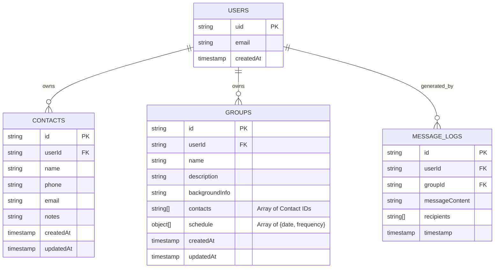

# Database Schema Diagram

## Firestore Collections

```mermaid
erDiagram
    USERS ||--o{ CONTACTS : "owns"
    USERS ||--o{ GROUPS : "owns"
    USERS ||--o{ MESSAGE_LOGS : "generated_by"
    
    USERS {
        string uid PK
        string email
        timestamp createdAt
    }

    CONTACTS {
        string id PK
        string userId FK
        string name
        string phone
        string email
        string notes
        timestamp createdAt
        timestamp updatedAt
    }

    GROUPS {
        string id PK
        string userId FK
        string name
        string description
        string backgroundInfo
        string[] contacts "Array of Contact IDs"
        object[] schedule "Array of {date, frequency}"
        timestamp createdAt
        timestamp updatedAt
    }

    MESSAGE_LOGS {
        string id PK
        string userId FK
        string groupId FK
        string messageContent
        string[] recipients
        timestamp timestamp
    }
```

## Indexes

- **contacts**: `userId` (ASC)
- **groups**: `userId` (ASC)
- **messageLogs**: `userId` (ASC), `groupId` (ASC)
